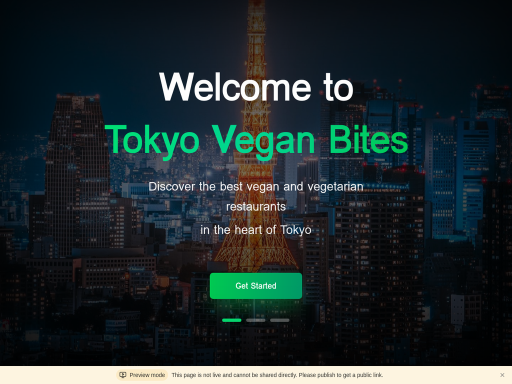
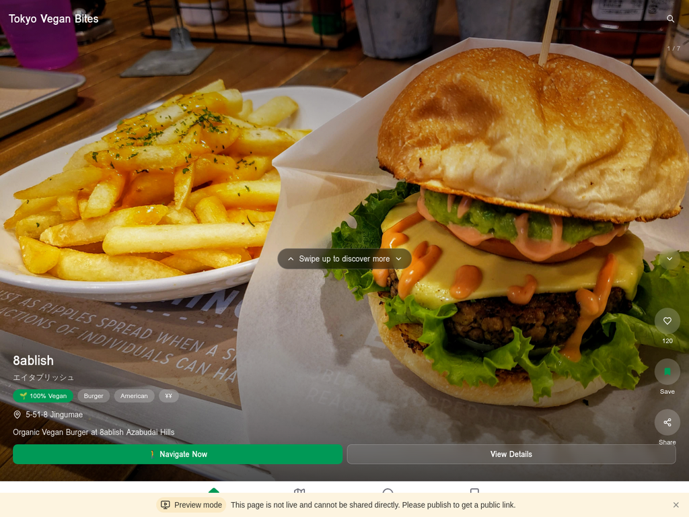
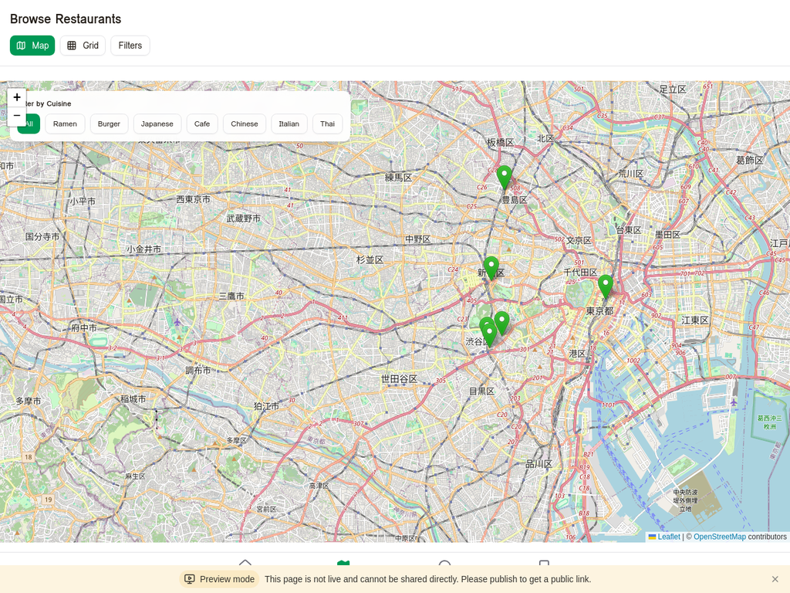
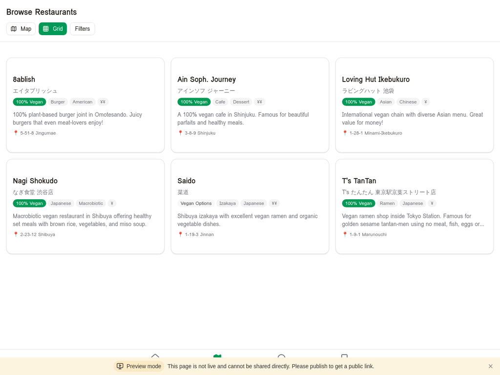
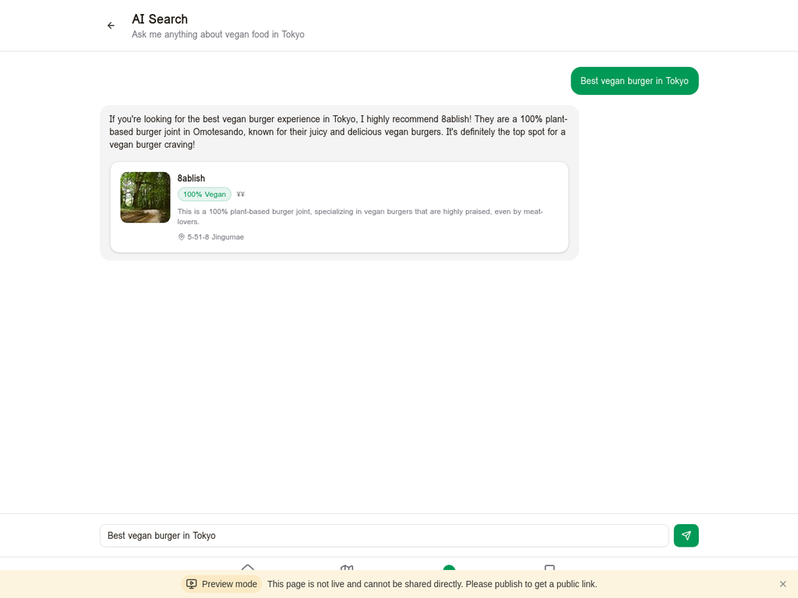
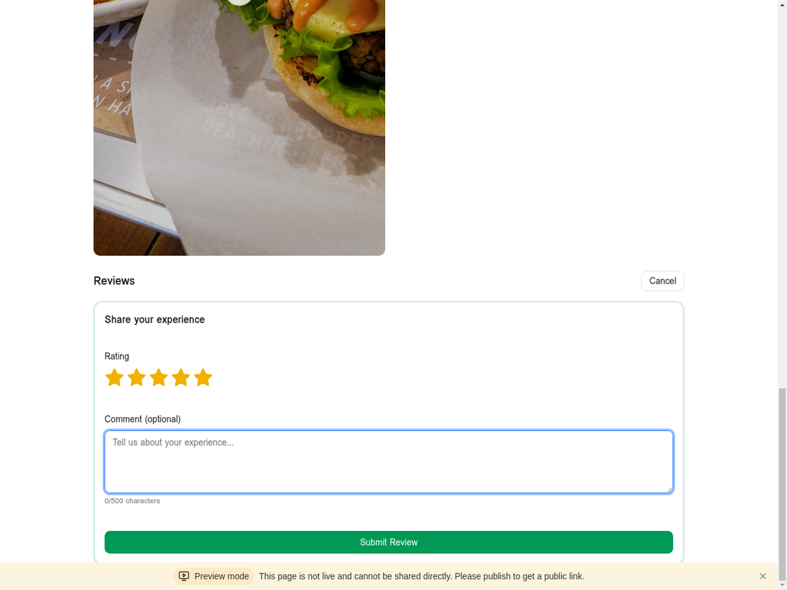

# Tokyo Vegan Bites 🌱

**東京のビーガン・ベジタリアンレストランを発見するためのモダンなWebアプリケーション**

[](https://tokyo-vegan-bites.vercel.app)
[](https://manus.im)
[](https://github.com/kgraph57/tokyo-vegan-bites)

🎥 **[Live Demo](https://tokyo-vegan-bites.vercel.app)** | 📱 **TikTok-Style UI** | 🤖 **AI-Powered Search**



---

## 🌟 概要

**Tokyo Vegan Bites**は、東京を訪れる外国人旅行者向けに設計された、次世代のビーガン・ベジタリアンレストラン発見アプリです。TikTok風の動画ファーストUI、AI搭載の自然言語検索、そして46店舗の実在するレストラン情報を提供します。

このプロジェクトは、**Manus AIコンテスト（#BuiltwithManus）**への応募作品として、企画から実装、本番デプロイまでをわずか数日で完成させました。

### 🎯 ターゲットユーザー

- 東京を訪れる外国人旅行者
- ヴィーガン/ベジタリアンの食生活を送る人
- 健康志向の旅行者
- インスタ映えするレストランを探している人

### 💡 なぜこのアプリを作ったのか

渋谷でヴィーガンラーメンが人気になっているなど、東京のヴィーガン市場は成長中です。しかし、既存のサービスは情報が古かったり、動画コンテンツが不足していたりと課題があります。Tokyo Vegan Bitesは、これらの課題を解決する次世代のレストラン発見プラットフォームです。

---

## ✨ 主な機能

### 🎬 シネマティックなウェルカム体験
- 東京タワーの美しい夜景を背景にした映画のようなオープニング
- スローズームアニメーション、グラデーションテキスト効果
- 段階的なフェードインアニメーション


### 📱 TikTokスタイルのビデオフィード
- 縦型フルスクリーンUIでレストランの魅力的な料理写真を閲覧
- スワイプ操作で次のレストランへ
- ブックマーク、シェア、ナビゲーション機能



### 🗺️ インタラクティブなレストラン検索
- **Mapビュー**: OpenStreetMapベースのインタラクティブマップで位置を確認
- **Gridビュー**: カード形式でレストラン一覧を表示
- **カテゴリーフィルター**: Ramen, Burger, Japanese, Cafe, Chinese, Italian, Thai




### 🤖 AI搭載の自然言語検索
- GPT-4.1-miniを使用した自然言語検索
- "渋谷の美味しいヴィーガンラーメンは？"のような質問に対して最適なレストランを推奨
- レストランの詳細情報と推奨理由を表示



### 📖 詳細なレストラン情報
- 高品質な料理写真
- レストラン名（英語・日本語）
- Veganバッジ（100% Vegan / Vegan Options）
- カテゴリーと価格帯
- 住所、営業時間、電話番号
- ウェブサイトとInstagramリンク
- メニュー（画像と価格付き）
- ユーザーレビューと評価


### ⭐ ブックマーク & レビュー機能
- お気に入りのレストランを保存
- レストランにレビューと評価を投稿
- 認証システムと統合
- ユーザーごとにブックマークとレビューを管理



### 🎯 オンボーディングフロー
- 初回訪問時に食事制限を選択（Vegan、Vegetarian、Gluten-free）
- 3ステップのスムーズなオンボーディング

---

## 🛠️ 技術スタック

### フロントエンド
- **React** - UIライブラリ
- **TypeScript** - 型安全性
- **Tailwind CSS** - モダンなスタイリング
- **Wouter** - 軽量ルーティング
- **TanStack Query** - データフェッチング
- **Leaflet** - インタラクティブマップ

### バックエンド
- **Express** - Webサーバー
- **tRPC** - 型安全なAPI
- **SQLite** - データベース
- **Drizzle ORM** - データベースORM

### AI統合
- **GPT-4.1-mini** - 自然言語検索
- **GPT-4o** - 画像認識（ヴィーガン料理検出）

### 認証
- **OAuth 2.0** - Manusプラットフォーム統合
- **セッションCookie** - 認証状態管理

### デプロイ
- **Vercel** - 本番環境ホスティング
- **GitHub** - ソースコード管理

---

## 📊 データ

- **46店舗**の実在するヴィーガンレストラン
  - 35店舗: 100% Vegan
  - 11店舗: Vegan Options
- **29のメニューアイテム**（画像と価格付き）
- **42件のユーザーレビュー**（英語・日本語）
- **8つのカテゴリー**: Ramen, Cafe, Indian, Japanese, Chinese, Italian, Thai, Specialty
- **東京全域をカバー**: Shibuya, Shinjuku, Minato, Chuo, Meguro, Setagaya, Chiyoda, Taito

データソース: [HappyCow](https://www.happycow.net), [Vegewel](https://vegewel.com)

---

## 🚀 セットアップ

### 前提条件
- Node.js 22.x
- pnpm

### インストール

```bash
# リポジトリのクローン
git clone https://github.com/kgraph57/tokyo-vegan-bites.git
cd tokyo-vegan-bites

# 依存関係のインストール
pnpm install

# 環境変数の設定
cp .env.example .env
# .envファイルを編集して必要な環境変数を設定

# データベースのセットアップ
pnpm db:push

# 開発サーバーの起動
pnpm dev
```

### 環境変数

必要な環境変数は`.env.example`を参照してください。

主な環境変数:
- `VITE_APP_ID` - アプリケーションID
- `VITE_OAUTH_PORTAL_URL` - OAuth認証ポータルURL
- `DATABASE_URL` - データベース接続URL

---

## 💻 開発

### 開発サーバーの起動

```bash
pnpm dev
```

ブラウザで `http://localhost:3002` を開きます。

### データベースマイグレーション

```bash
# マイグレーションの生成
pnpm db:generate

# マイグレーションの適用
pnpm db:push

# Drizzle Studioの起動（データベースGUI）
pnpm db:studio
```

### ビルド

```bash
pnpm build
```

### 本番環境での起動

```bash
pnpm start
```

---

## 📁 プロジェクト構造

```
tokyo-vegan-bites/
├── client/                 # フロントエンドコード
│   ├── public/            # 静的ファイル
│   │   └── images/        # 画像ファイル
│   └── src/
│       ├── components/    # Reactコンポーネント
│       ├── pages/         # ページコンポーネント
│       ├── lib/           # ユーティリティ
│       └── _core/         # コア機能
├── server/                # バックエンドコード
│   ├── routers.ts         # tRPCルーター
│   ├── db.ts              # データベース関数
│   ├── seed-data/         # シードデータ
│   └── _core/             # コア機能
├── db/                    # データベースファイル
├── shared/                # 共有型定義
├── screenshots/           # アプリのスクリーンショット
└── scripts/               # ユーティリティスクリプト
```

---

## ✅ テスト

詳細なテスト結果は`TEST_RESULTS.md`を参照してください。

すべての主要機能が正常に動作することを確認済みです:
- ✅ ウェルカム画面とオンボーディング
- ✅ TikTokスタイルのビデオフィード
- ✅ レストラン詳細ページ
- ✅ Browse（Map/Gridビュー）
- ✅ AI検索機能
- ✅ ブックマーク機能
- ✅ レビュー/評価システム
- ✅ OAuth 2.0認証
- ✅ ナビゲーションとルーティング

---

## 🏆 Manus AIコンテスト

このプロジェクトは、**Manus AIコンテスト（#BuiltwithManus）**への応募作品です。

### 開発期間
約3-4日（企画から本番デプロイまで）

### 開発プロセス
1. **市場調査**: HappyCow、Vegewelなどの既存サービスを分析
2. **データ収集**: 46店舗の実在するレストラン情報を収集
3. **UI/UXデザイン**: TikTok風の動画ファーストUIを設計
4. **フルスタック実装**: React + Express + tRPC + SQLite
5. **AI統合**: GPT-4.1-miniによる自然言語検索を実装
6. **本番デプロイ**: Vercelに本番環境をデプロイ
7. **テストと最適化**: 全機能の動作確認とパフォーマンス最適化

### プロジェクトのハイライト
- **ビデオファーストのアプローチ**: 従来のレストラン検索アプリとは異なり、TikTok/Instagram Reelsのような動画中心のUIを採用
- **AI統合**: GPT-4.1-miniによる自然言語検索とGPT-4oによる画像認識機能
- **実データ**: 46店舗すべてが実在するレストラン（HappyCow、Vegewelなどから収集）
- **フルスタック実装**: フロントエンドからバックエンド、データベース、認証まで完全に実装
- **本番環境**: Vercelにデプロイされ、誰でもアクセス可能

コンテスト提出資料は`CONTEST_SUBMISSION.md`を参照してください。

---

## 📚 ドキュメント

- **[CONTEST_SUBMISSION.md](./CONTEST_SUBMISSION.md)** - コンテスト提出資料
- **[CONTEST_SNS_POST.md](./CONTEST_SNS_POST.md)** - SNS投稿文案
- **[TEST_RESULTS.md](./TEST_RESULTS.md)** - テスト結果
- **[COMPLETION_REPORT.md](./COMPLETION_REPORT.md)** - 完成報告書
- **[FINAL_PROJECT_REPORT.md](./FINAL_PROJECT_REPORT.md)** - 最終プロジェクト報告書
- **[SCREENSHOTS.md](./SCREENSHOTS.md)** - スクリーンショット一覧

---

## 🤝 貢献

プルリクエストを歓迎します。大きな変更の場合は、まずissueを開いて変更内容を議論してください。

---

## 📄 ライセンス

MIT

---

## 🙏 謝辞

- **Manus AI** - 開発支援とホスティング
- **OpenStreetMap** - マップデータ
- **Leaflet** - マップライブラリ
- **HappyCow** - レストランデータソース
- **Vegewel** - レストランデータソース

---

## 📞 お問い合わせ

プロジェクトに関するご質問やフィードバックは、GitHubのIssueまでお願いします。

---

**Tokyo Vegan Bites** - 東京のビーガン・ベジタリアンレストランを発見しよう 🌱

[🎥 Live Demo](https://tokyo-vegan-bites.vercel.app) | [📱 GitHub](https://github.com/kgraph57/tokyo-vegan-bites) | [#BuiltwithManus](https://twitter.com/search?q=%23BuiltwithManus)

