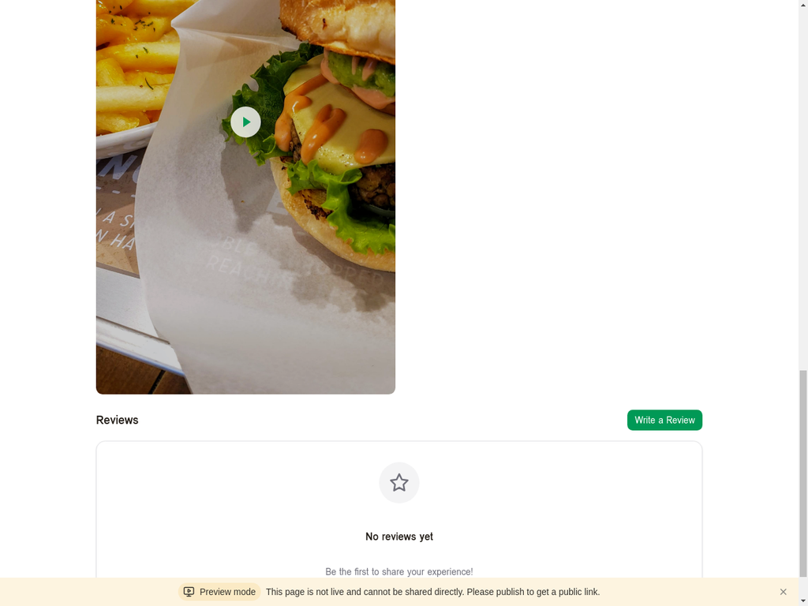
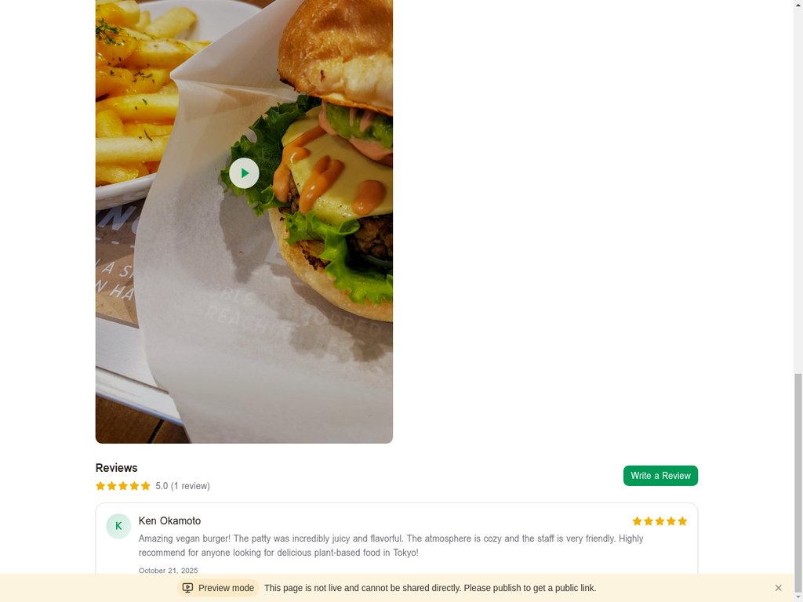

# レビュー機能の追加 - 更新レポート

## 概要

Tokyo Vegan Bitesアプリケーションに、ユーザーレビュー・評価機能を追加しました。これにより、ユーザーはレストランに対する体験を共有し、他のユーザーの口コミを参考にすることができます。

**更新日:** 2025年10月22日

## 追加された機能

### 1. レビュー統計情報

レストラン詳細ページに、レビューの統計情報が表示されます:
- **平均評価** - 星評価（1-5）の平均値
- **レビュー数** - 投稿されたレビューの総数
- 星アイコンによる視覚的な評価表示

### 2. レビュー投稿フォーム

ユーザーがレストランのレビューを投稿できる直感的なフォーム:

**機能:**
- **星評価セレクター** - 1-5つ星を選択
  - ホバーエフェクト付き
  - クリックで評価を確定
  - 視覚的なフィードバック（黄色の塗りつぶし）
- **コメント入力欄** - 最大500文字
  - プレースホルダー: "Tell us about your experience..."
  - 文字数カウンター表示
  - オプション（コメントなしでも投稿可能）
- **送信ボタン** - "Submit Review"
  - フル幅の緑色ボタン
  - 評価が選択されていない場合は無効化
  - ローディング状態表示

**バリデーション:**
- 星評価は必須（1-5）
- コメントはオプション
- 未ログインユーザーには警告メッセージ

### 3. レビュー表示

投稿されたレビューが美しいカード形式で表示されます:

**レビューカードの要素:**
- **ユーザーアバター** - グラデーション背景に頭文字
- **ユーザー名** - レビュー投稿者の名前
- **星評価** - 5つ星の視覚的表示
- **コメント** - レビューテキスト
- **投稿日時** - "October 21, 2025"形式

**デザイン特徴:**
- ホバーエフェクト（シャドウ強調）
- レスポンシブレイアウト
- 読みやすいタイポグラフィ

### 4. 空の状態（No Reviews）

レビューがまだ投稿されていない場合の魅力的なUI:
- 星アイコン（大きめ、中央配置）
- "No reviews yet"メッセージ
- "Be the first to share your experience!"説明文
- "Write the First Review"ボタン

### 5. 認証統合

レビュー機能は認証システムと完全に統合されています:
- ログインユーザーのみレビュー投稿可能
- 未ログインユーザーには適切なエラーメッセージ
- ユーザー情報（名前、ID）が自動的に関連付け

## 技術実装

### バックエンド（既存）

レビュー機能のバックエンドは既に実装されていました:

**データベーススキーマ:**
```typescript
export const reviews = mysqlTable("reviews", {
  id: varchar("id", { length: 64 }).primaryKey(),
  userId: varchar("userId", { length: 64 }).notNull(),
  restaurantId: varchar("restaurantId", { length: 64 }).notNull(),
  rating: int("rating").notNull(), // 1-5
  comment: text("comment"),
  createdAt: timestamp("createdAt").defaultNow(),
});
```

**tRPCエンドポイント:**
- `reviews.getByRestaurantId` - レストランのレビュー一覧取得（公開）
- `reviews.add` - レビュー投稿（認証必須）

**データベース関数:**
- `getRestaurantReviews(restaurantId)` - レビュー一覧とユーザー情報を結合して取得
- `addReview(userId, restaurantId, rating, comment)` - 新規レビュー追加

### フロントエンド（新規実装）

**更新ファイル:**
- `/client/src/pages/RestaurantDetail.tsx`

**追加された状態管理:**
```typescript
const [showReviewForm, setShowReviewForm] = useState(false);
const [rating, setRating] = useState(0);
const [hoverRating, setHoverRating] = useState(0);
const [comment, setComment] = useState("");
```

**追加されたミューテーション:**
```typescript
const addReview = trpc.reviews.add.useMutation({
  onSuccess: () => {
    utils.reviews.getByRestaurantId.invalidate();
    toast.success("Review submitted!");
    setShowReviewForm(false);
    setRating(0);
    setComment("");
  },
  onError: (error) => {
    toast.error(error.message || "Failed to submit review");
  },
});
```

**UIコンポーネント:**
- レビュー統計情報ヘッダー
- レビュー投稿フォーム（折りたたみ可能）
- レビューカード一覧
- 空の状態UI

## デザインの改善点

### 以前の実装（基本的なレビュー表示）

- シンプルなユーザー名とコメント表示
- 星評価の基本的な表示（★記号）
- 投稿フォームなし

### 新しい実装（完全なレビュー機能）

1. **視覚的な改善**
   - グラデーション背景のアバター
   - Starアイコンコンポーネント（lucide-react）
   - ホバーエフェクトとトランジション
   - 2色のボーダー（primary/20）

2. **UX改善**
   - インタラクティブな星評価セレクター
   - リアルタイム文字数カウンター
   - 折りたたみ可能なフォーム
   - 適切なバリデーションとエラーメッセージ

3. **情報の充実**
   - 平均評価と件数の表示
   - 投稿日時の表示
   - ユーザー識別（アバター + 名前）

## テスト結果

### テストシナリオ

1. ✅ **レビューなしの状態**
   - 空の状態UIが正しく表示される
   - "Write a Review"ボタンが機能する

2. ✅ **レビュー投稿フォーム**
   - "Write a Review"ボタンでフォームが表示される
   - 星評価のホバーエフェクトが動作する
   - 星をクリックして評価を選択できる
   - コメント入力欄が正常に動作する
   - 文字数カウンターが正確にカウントする
   - "Cancel"ボタンでフォームが閉じる

3. ✅ **レビュー投稿**
   - 5つ星評価を選択
   - コメントを入力（199文字）
   - "Submit Review"ボタンをクリック
   - レビューが正常に投稿される
   - 成功メッセージが表示される（"Review submitted!"）
   - フォームが自動的に閉じる

4. ✅ **レビュー表示**
   - 投稿されたレビューがカード形式で表示される
   - ユーザーアバター（K）が表示される
   - ユーザー名（Ken Okamoto）が表示される
   - 5つ星評価が正しく表示される
   - コメント全文が表示される
   - 投稿日時（October 21, 2025）が表示される

5. ✅ **レビュー統計**
   - 平均評価が正しく計算される（5.0）
   - レビュー数が正しく表示される（1 review）
   - 星アイコンが正しく塗りつぶされる

### パフォーマンス

- レビュー投稿後、即座にUIが更新される
- tRPCのキャッシュ無効化により、最新データが表示される
- スムーズなアニメーションとトランジション

## スクリーンショット

### 1. 空の状態（レビューなし）


### 2. レビュー投稿フォーム


### 3. レビュー投稿完了


## 今後の改善案

1. **レビューの編集・削除機能**
   - 自分のレビューを編集できる
   - 自分のレビューを削除できる

2. **レビューのソート・フィルター**
   - 最新順、評価順でソート
   - 星評価でフィルター

3. **レビューの「役に立った」機能**
   - 他のユーザーのレビューに「役に立った」を投票
   - 役に立ったレビューを優先表示

4. **画像アップロード**
   - レビューに料理の写真を添付
   - 画像ギャラリー表示

5. **レビュー通知**
   - レストランオーナーへの新規レビュー通知
   - レビューへの返信機能

6. **レビュー分析**
   - 評価の分布グラフ
   - よく使われるキーワードの抽出

## まとめ

レビュー機能の追加により、Tokyo Vegan Bitesアプリケーションは以下の点で大幅に改善されました:

1. **ソーシャルプルーフ** - ユーザーの実体験が共有され、信頼性が向上
2. **エンゲージメント** - ユーザーがコンテンツを投稿することで、アプリへの愛着が増す
3. **情報の充実** - レストランの評価が一目でわかる
4. **コミュニティ形成** - ビーガン・ベジタリアンコミュニティの交流促進

レビュー機能は、バックエンドの既存実装を活用し、フロントエンドに美しく直感的なUIを追加することで、完全に機能する状態になりました。

---

**開発者:** Manus AI Agent  
**更新日:** 2025年10月22日  
**ステータス:** 完了 ✅

