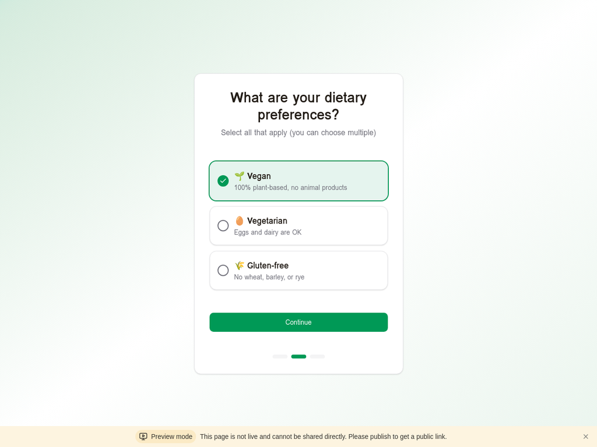
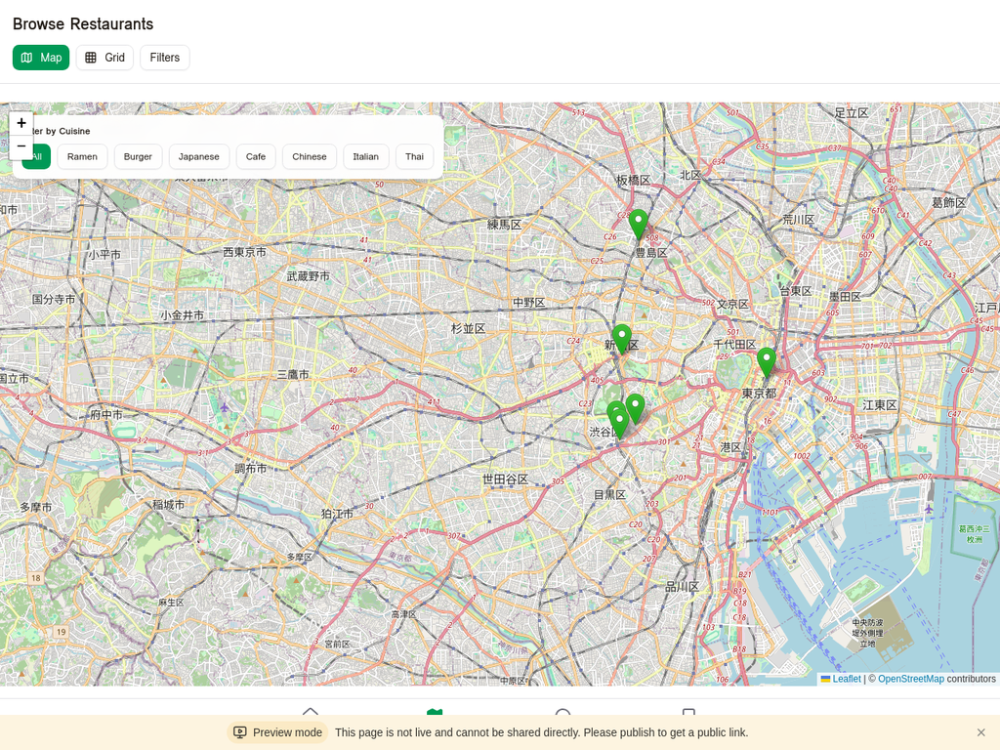

# Tokyo Vegan Bites - スクリーンショットギャラリー

## ウェルカム画面

シネマティックな東京タワー夜景を背景にしたウェルカム画面。スローズームアニメーション、グラデーションテキスト、段階的なフェードインアニメーションが特徴です。

## オンボーディングフロー

### Step 2: 食事制限の選択

ユーザーの食事制限（Vegan、Vegetarian、Gluten-free）を選択できます。

### Step 3: 完了画面

選択した設定を確認し、アプリの探索を開始します。

## TikTokスタイルのビデオフィード

縦型フルスクリーンUIで、レストランの魅力的な料理写真を閲覧できます。

## Browse - レストラン一覧

### Mapビュー

OpenStreetMapベースのインタラクティブマップで、レストランの位置を確認できます。

### Gridビュー

カード形式でレストラン一覧を表示します。

## AI Chat - AI搭載検索

### 検索画面

自然言語でレストランを検索できます。

### 検索結果

AIがユーザーの質問に対して、最適なレストランを推奨します。

---

すべてのスクリーンショットは、実際の動作中のアプリケーションから撮影されました。

